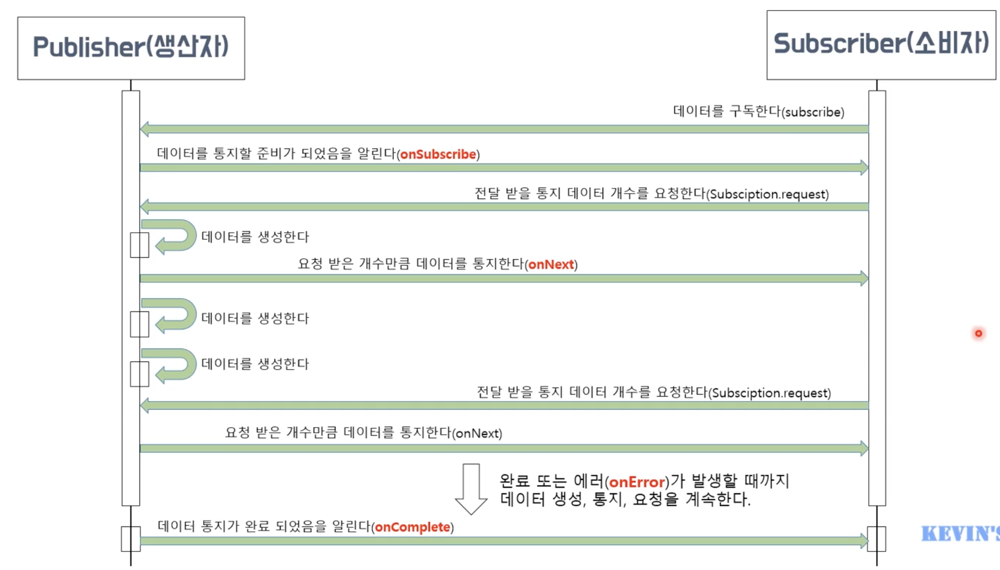

### 시작하기전

- 데이터를 생성 해서 내보내는 것은 생산자
- 생산자가 데이터를 내보내는 행위는 데이터를 통지
- 생산자가 보낸 데이터를 처리하는 것은 소비자
- 소비자가 데이터를 처리하는 것은 데이터를 소비하는 것

`생산자 -> 데이터 생성 -> 데이터 통지 -> 소비자 -> 데이터 처리`

Chap1의 리액티브 동작 흐름임.

# Reactive Streams란?

- 리애기브 프로그래밍 라이브러리의 표준 사양이다.
- 리액티브 프로그래밍에 대한 인터페이스만 제공한다.
- RxJava는 Reactive Streams의 인터페이스들을 구현한 구현체이다.
- Reactie Streams 아래의 4개의 인터페이스를 제공한다.
  - Publisher - 데이터를 생성하고 통지한다.
  - Subscriber - 통지된 데이터를 전달받아서 처리한다.
  - Subscription - 전달 받은 데이터의 개수를 요청하고 구독을 해지한다
  - Processor - Publisher와 Subscriber의 기능이 모두 있음.

생산자와 소비자 간의 프로세스 플로우

## Cold Publisher & Hot Publisher

- Cold publisher
  - 생산자는 소비자가 구독 할때마다 데이터를 처음부터 새로 통지한다.
  - 데이터를 통지하는 새로운 타임 라인이 생성된다.
  - 소비자는 구독 시점과 상관없이 통지된 데이터를 처음부터 전달 받을 수 있다.

- Hot publisher
  - 생산자는 소비자 수와 상관없이 데이터를 한번만 통지한다
  - 즉 데이터를 통지하는 타임 라인은 하나이다.
  - 소비자는 발행된 데이터를 처음붜 전달 받는게 아니라 구독한 시점에 통지된 데이터들만 전달 받을 수 있다.

- 플로우 비교
  - Cold Publisher Flow
  
  - Hot Publisher Flow
  